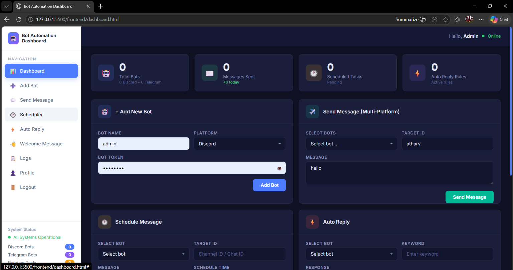

#  Multi-Platform Bot Dashboard System

> **A centralized, web-based command center to control, automate, and monitor your Discord and Telegram bots—all from one elegant interface.**


### System Architecture Overview


---

##  Key Features

- **Unified Management** — Add, configure, and manage multiple bots from a single dashboard.
- **Dual-Platform Support** — Fully integrated with both **Discord** and **Telegram**.
- **Smart Automation** — Set up intelligent auto-replies and warm welcome messages for your communities.


- **Task Scheduling** — Schedule routine announcements and automated messages with ease.



- **Multi-User Support** — Allow multiple admins to access the dashboard and manage bot operations.
- **Activity Logs** — Track bot performance, user interactions, and system errors in real-time.


---

## Tech Stack

We utilize a modern, lightweight, and incredibly fast stack to ensure smooth performance:

| Category | Technologies Used |
| :--- | :--- |
| **Backend** | FastAPI, SQLAlchemy, SQLite, Pydantic, Uvicorn |
| **Frontend** | HTML5, CSS3, Vanilla JavaScript |
| **Bot Frameworks** | `discord.py`, `python-telegram-bot` |

### Backend & Data Flow


---

## Project Architecture

A clean, modular structure separates our web API, bot instances, and frontend assets.

```text
bot-dashboard/
│
├── backend/           # FastAPI application, routes, and database models
├── bot_service/       # Core logic for Discord & Telegram bot connections
├── frontend/          # HTML/CSS/JS files for the dashboard UI
├── docs/              # Project documentation and API references
├── requirements.txt   # Python dependencies
├── README.md          # You are here!
└── .env               # Environment variables (Tokens, API keys - DO NOT COMMIT)